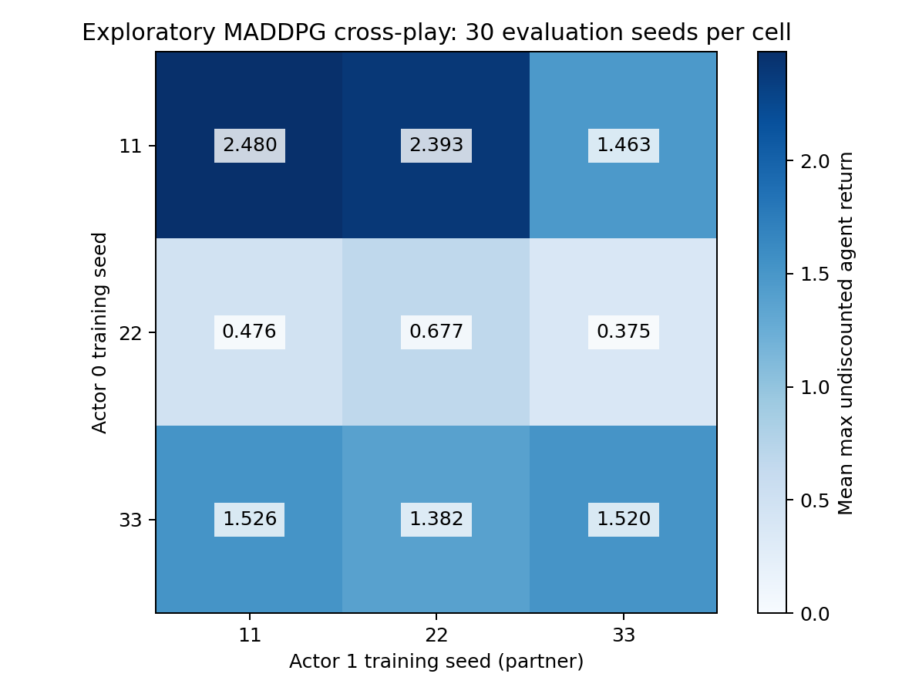

# Exploratory MADDPG cross-play

This is a post-training partner-compatibility analysis, separate from the original algorithm comparison. Rows supply actor 0 and columns supply actor 1; roles are never swapped. Three diagonal cells reuse verified original-pair evaluations; six ordered off-diagonal pairs each run 30 new episodes on the same fixed environment seed list. No critic, optimizer, exploration, learning, selection by evaluation, or score-based retries are used.

| Actor 0 seed | Actor 1 seed | Mean score | Within-cell population SD | Mean actor 0 return | Mean actor 1 return | Signed self-play gap | Episodes / external truncations |
|---|---|---:|---:|---:|---:|---:|---|
| 11 | 11 | 2.480000 | 0.449741 | 2.480000 | 2.479333 | 0.000000 | 30 / 0 |
| 11 | 22 | 2.393000 | 0.638295 | 2.379333 | 2.393000 | 0.087000 | 30 / 0 |
| 11 | 33 | 1.463000 | 1.022693 | 1.434000 | 1.439667 | 1.017000 | 30 / 0 |
| 22 | 11 | 0.476333 | 0.591363 | 0.421333 | 0.445000 | 0.200333 | 30 / 0 |
| 22 | 22 | 0.676667 | 0.861659 | 0.616333 | 0.658000 | 0.000000 | 30 / 0 |
| 22 | 33 | 0.375000 | 0.487912 | 0.340333 | 0.343000 | 0.301667 | 30 / 0 |
| 33 | 11 | 1.526333 | 1.228078 | 1.505000 | 1.524000 | -0.006000 | 30 / 0 |
| 33 | 22 | 1.382333 | 1.219985 | 1.355000 | 1.380000 | 0.138000 | 30 / 0 |
| 33 | 33 | 1.520333 | 1.241619 | 1.483000 | 1.512667 | 0.000000 | 30 / 0 |

Diagonal mean: **1.559000**. Off-diagonal mean: **1.269333**. These average model-combination means, not independent training seeds.

Signed self-play gap = row diagonal mean minus cell mean: positive means the fixed actor-0 policy performs worse in the joint score when paired with the new actor-1 partner. This is a descriptive joint outcome, not evidence assigning blame to a particular actor. Reverse pairings are different experiments.

All cell-level episode records and source checkpoint hashes are retained. External truncation withholds a cell aggregate. Local_done still cannot distinguish internal timeout from true termination. The maximum-agent score can conceal individual return differences, hence both returns are reported.

Six off-diagonal cells share the same three trained actor pairs and use aligned environment seeds; they are not six independent training runs. No confidence interval, statistical significance, arbitrary-partner generalization, or causal claim about centralized training is made. These data do not tune or select the original checkpoints.

## Observed partner-change outcomes

Compared with each row actor-0 policy’s original partner, 5 of six new pairings had a lower mean joint score, 1 had a higher mean, and 0 were equal. These are observed cell comparisons, not independent replications or a significance test.

Lower cells indicate a measured cost of changing partners in this evaluated set; higher or similar cells show compatibility only within these specific actor roles, training seeds and initial conditions. No conclusion about arbitrary unseen partners follows.

