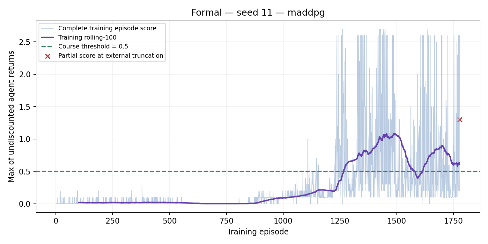
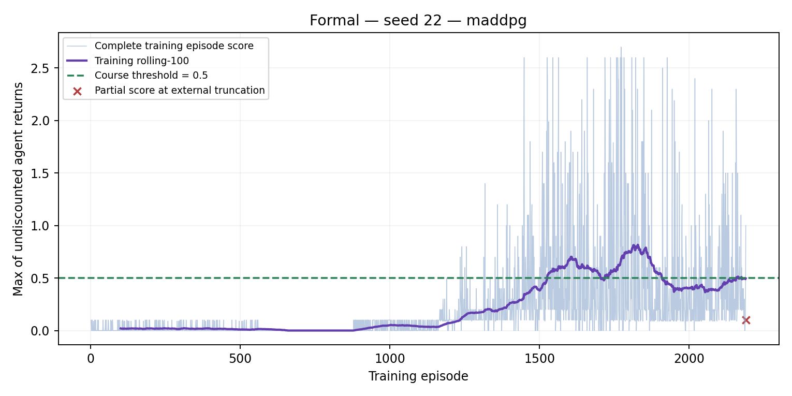
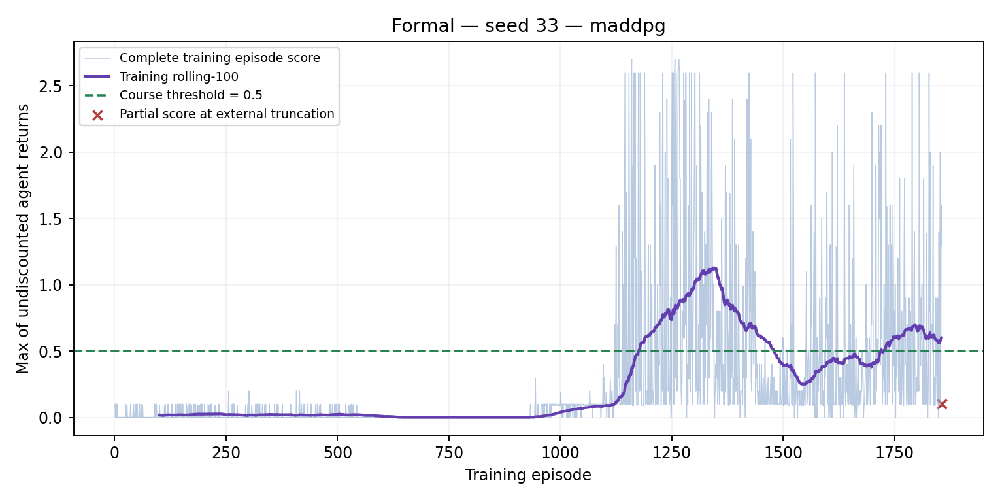
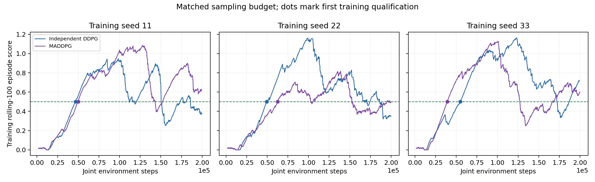
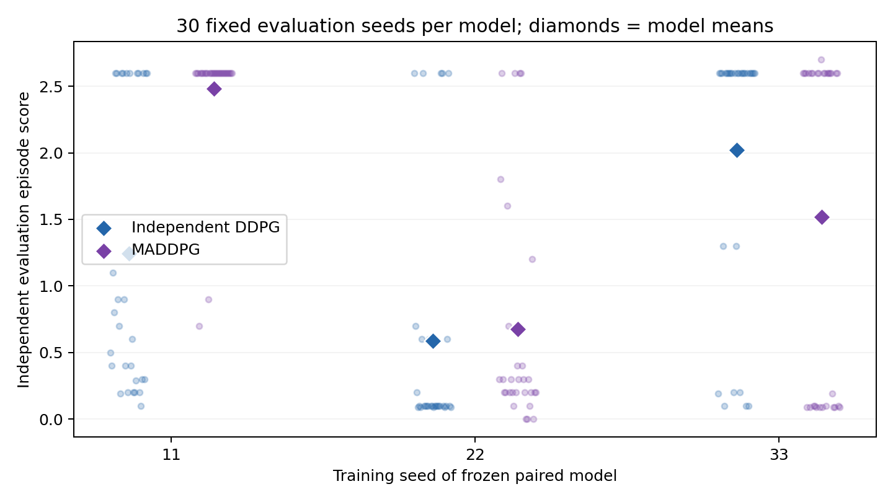

# MADDPG matched-budget comparison

Both methods use local actors. Independent DDPG has local critics; MADDPG critics condition on joint observations/actions. Hyperparameters, training seeds, environment-step budgets, selection rules and evaluation seeds are matched. Critic parameter counts and compute differ.

| Algorithm | Seed | First solved episode | Complete training episodes | Training truncations | Independent evaluation mean | Within-model population SD |
|---|---:|---:|---:|---:|---:|---:|
| Independent DDPG | 11 | 1282 | 1971 | 1 | 1.242667 | 1.057569 |
| Independent DDPG | 22 | 1473 | 2085 | 1 | 0.588333 | 0.916814 |
| Independent DDPG | 33 | 1222 | 1692 | 1 | 2.023000 | 0.991131 |
| MADDPG | 11 | 1267 | 1776 | 1 | 2.480000 | 0.449741 |
| MADDPG | 22 | 1526 | 2190 | 1 | 0.676667 | 0.861659 |
| MADDPG | 33 | 1176 | 1855 | 1 | 1.520333 | 1.241619 |

| Algorithm | Across-model evaluation mean | Population SD of three model means |
|---|---:|---:|
| Independent DDPG | 1.284667 | 0.586453 |
| MADDPG | 1.559000 | 0.736715 |

These are descriptive results from three training seeds, not confidence intervals or statistical significance. Unsolved training seeds remain in the table and use final checkpoints. No checkpoint was selected using evaluation scores. Pilot results are excluded.

Compute costs and single-episode training maxima are recorded separately in the result JSON; no runtime superiority is inferred from concurrently executed jobs.

## Sampling efficiency and interpretation

| Training seed | Independent DDPG first qualifying environment step | MADDPG first qualifying environment step |
|---|---:|---:|
| 11 | 46624 | 50011 |
| 22 | 49322 | 62760 |
| 33 | 54761 | 39320 |

Episode counts are not equal sampling budgets: better rallies can make episodes longer. These curves retain each run separately and show training rolling-100, not evaluation.

Faint dots are actual evaluation episodes; diamonds are per-model means. No confidence-interval error bars are shown. The same evaluation seed list is used across models; the 90 episodes for an algorithm must not be treated as 90 independent training runs.

| Online network parameters (two agents) | Independent DDPG | MADDPG |
|---|---:|---:|
| Actors | 39940 | 39940 |
| Critics | 40194 | 46850 |

Target networks duplicate the corresponding online architectures. More centralized-critic parameters and concurrently executed jobs limit parameter/compute claims. Observed runtime is logged, not a speed superiority test.

A complete evaluation episode here ends on legacy `local_done`; this API does not prove whether that signal represents true termination or an internal time limit. External caps are separately recorded. Cross-play and partner generalization have not been tested.

Under this frozen protocol, the observed MADDPG across-model evaluation mean is higher than independent DDPG (1.559000 versus 1.284667). This describes the measured models; three training seeds and unequal critic parameter counts do not establish general or statistically significant superiority.

## Rendered demonstration

A user-recorded [19.91-second Unity excerpt](artifacts/tennis_maddpg_demo.mov) shows the frozen seed-11 paired policy, without exploration or learning. It is separate from the predeclared evaluations and does not represent the complete rollout or average performance. `artifacts/tennis_demo_metadata.json` records the video and model hashes.
