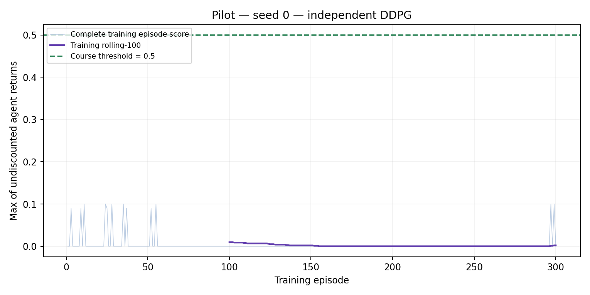
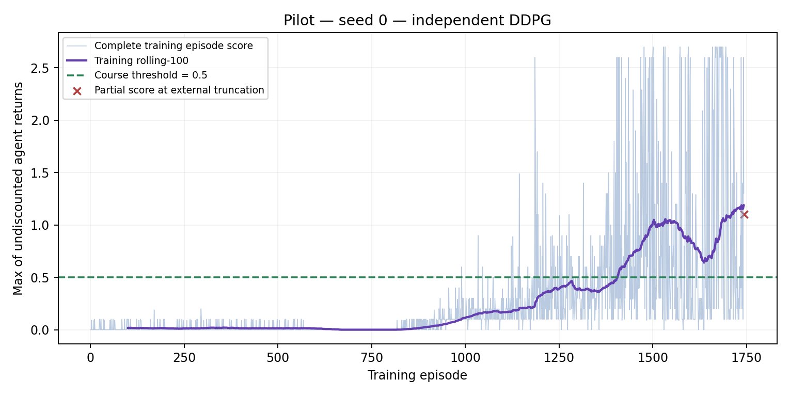
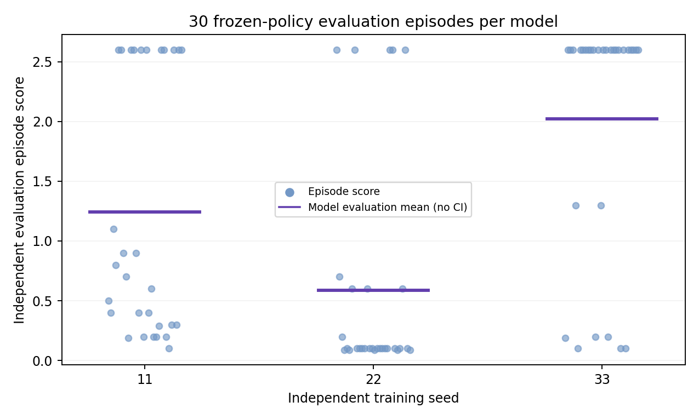
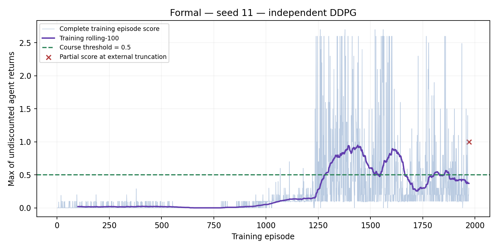
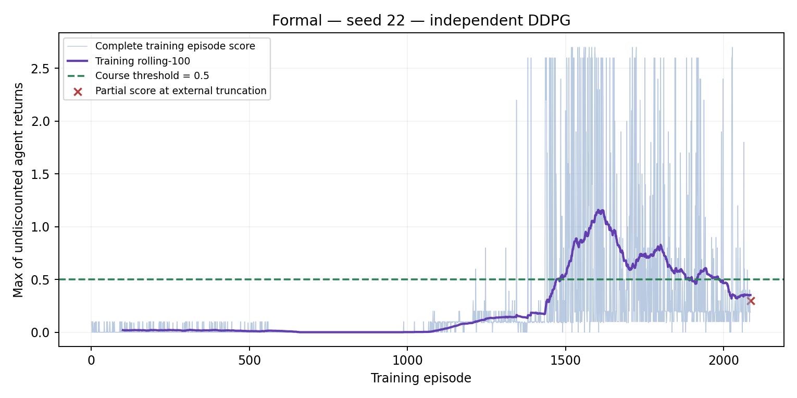
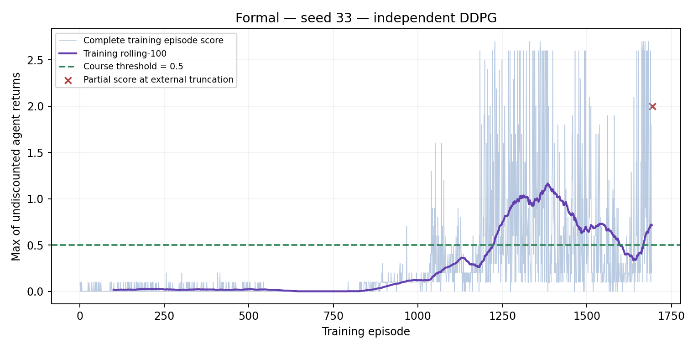

# Independent DDPG for Two-Agent Unity Tennis

## Scope and status

This project implements two independent DDPG agents for Udacity's supplied Tennis environment. It investigates a simple local-critic baseline before introducing centralized critics. The baseline is **not MADDPG**. Implementation checks and real development pilots are complete. Confirmatory three-seed training and independent evaluation are complete; development pilots and confirmatory measurements are reported separately below.

## Problem

Agents interact through a shared ball, so partner behavior affects each agent's transition distribution. Updating the partner's policy can make the effective learning environment nonstationary even though the simulator physics are fixed. Each agent receives 8 observation variables stacked 3 times (24-dimensional runtime input), and selects two continuous actions within [-1,1]. The reward is +0.1 for hitting over the net and -0.01 for dropping or hitting out. The objective encourages rallies; it is not a zero-sum win/loss game.

For episode e, compute each agent's undiscounted return G[e,i] = sum_t r[e,t,i], then S[e] = max_i G[e,i]. The course threshold is mean(S[e-99:e+1]) >=0.5. We only qualify a window of 100 consecutive complete episodes; external truncation clears it.

## Implementation

Each agent has separate online/target actors and critics, optimizers and parameters. Actors map 24 -> 128 ReLU -> 128 ReLU -> 2 tanh. Local critics concatenate the observation and own action, mapping 26 -> 128 ReLU -> 128 ReLU -> 1. Final layer weights and biases initialize uniformly in [-0.003,0.003]; other layers use PyTorch Linear defaults.

Joint ring-buffer transitions preserve both agents from the same step: observations [2,24], actions [2,2], rewards [2], next observations [2,24], masks [2]. Agents train on their own slices. Uniform minibatches contain 128 joint transitions without replacement within a batch; transitions may be reused across updates. Replay capacity is 100000.

For agent i, the critic target is:

```text
a'_i = target_actor_i(o'_i)
y_i = r_i + gamma * (1 - terminal_i) * target_critic_i(o'_i, a'_i)
critic_loss_i = mean((critic_i(o_i, executed_a_i) - y_i)^2)
actor_loss_i = -mean(critic_i(o_i, actor_i(o_i)))
```

All scalar Bellman tensors have shape [B,1]. Target calculation uses no_grad. Actor learning freezes critic parameters while preserving the action gradient. Each agent's gradients are clipped to norm 1.0. Target networks initialize as online copies and update by target <- (1-tau)*target + tau*online after each agent update.

Adam learning rates: actor 1e-4, critic 1e-3; gamma=0.99, tau=0.005. Training starts with 10000 uniform random environment steps. Afterwards add independent zero-mean Gaussian action noise with standard deviation 0.2, then clip. Noise is constant, with no decay. Target, actor loss and evaluation actions do not use noise. One full learning round per environment step after warm-up means four optimizer steps (two actors, two critics). This baseline uses CPU with one Torch thread per training process.

The adapter canonicalizes observations/rewards by agent ID and translates actions back into Unity row order. It preserves initial reset role order across later resets and rejects changed identity sets. Replay stores actions actually executed after exploration and clipping.

## Tests and runtime audit

21 tests cover Bellman values and broadcast rejection, target initialization/soft update, gradient isolation, actual actor updates, replay ring alignment and validation, checkpoint continuation, identity mapping, correct episode scoring, external truncation and evaluation without learning. These are implementation checks, not proof of policy performance.

Three real random-policy smoke episodes completed. Unity reported 8 observation variables, 3 stacks, 2 continuous actions and two agents. Both local_done signals were true at their ends. The downloaded binary's Info.plist identifies Unity Player 2017.3.1f1 (fc1d3344e6ea), x86_64. Runtime stack: Python 3.9.6, Torch 2.8.0, NumPy 2.0.2 on Apple Silicon macOS. Hashes and source revision are recorded in the artifact manifests.

## Development pilots (excluded from final evidence)

| Run | Complete episodes | External truncations | Environment steps | First qualifying window endpoint | Highest training rolling-100 |
|---|---:|---:|---:|---:|---:|
| seed 0, warm-up 1000 | 300 | 0 | 4503 | Not solved | 0.0095 |
| seed 0, warm-up 10000, longer budget | 1743 | 1 | 200000 | 1407 | 1.1885 |

The long pilot's first qualifying endpoint occurred at 76871 environment steps. Its single-episode maximum was 2.70, which is neither a rolling mean nor independent evaluation. It ran 190001 full learning rounds. The final partial episode ended at the global environment-step budget and was excluded from the qualifying window. Measured elapsed time was 740.12 seconds on this run; this is not a hardware-independent benchmark.

The short pilot developed saturated actions: on the 60 observations collected during smoke testing, about 80.4% of actor action components exceeded absolute value 0.99. Five subsequent no-exploration diagnostic episodes had mean score 0.04. These evaluation seeds belong to development, not the final held-out set. The first diagnostic attempt exposed a legacy class-level Pipe reuse bug after one evaluation episode; that incomplete attempt was retained locally. Evaluation now uses fresh subprocesses, and all five diagnostic episodes completed.

The longer pilot changed both warm-up and training budget, so it does **not** isolate the causal contribution of warm-up. Its success motivates checking the frozen configuration on new seeds, not claiming an algorithm improvement.




## Frozen confirmatory protocol

PROTOCOL.json was committed before launching seeds 11,22,33. Each run has at most 3000 episodes or 200000 environment steps, with external episode cap 10000 steps. Hyperparameters are identical. The first complete rolling-100 >=0.5 checkpoint is chosen without evaluation feedback; unsolved seeds retain and evaluate the final model with the failure disclosed.

Each frozen model is evaluated on 30 predeclared Unity seeds 20001-20030, in separate processes, without exploration or learning. The same evaluation seed set is used for each model to align initial-condition comparisons; it is disjoint from training and development evaluation seeds. Any truncated evaluation prevents reporting a complete aggregate mean. Across models we report the mean and population SD of the three per-model evaluation means. This is not a confidence interval or significance test.

All three training seeds reached the threshold: first qualifying endpoints 1282 / 1473 / 1222 at 46624 / 49322 / 54761 environment steps. Each ran its full 200000-step budget and ended with one external budget truncation. This is training evidence, not independent evaluation.

Evaluation orchestration was changed to run models concurrently. Ending the original coordinator also caused its evaluator subprocess to be cleaned up by the execution tool. The first 10 complete seed-11 evaluation episodes were retained, the incomplete attempt directory was archived, and only the remaining predeclared seeds were resumed using the unchanged checkpoint hash. This infrastructure interruption is not a score-based retry or seed replacement.

## Confirmatory results

| Training seed | First solved episode | First solved environment step | Complete training episodes | Training truncations | Evaluation mean | Within-model population SD | Evaluation episodes / truncations |
|---|---:|---:|---:|---:|---:|---:|---:|
| 11 | 1282 | 46624 | 1971 | 1 | 1.242667 | 1.057569 | 30 / 0 |
| 22 | 1473 | 49322 | 2085 | 1 | 0.588333 | 0.916814 | 30 / 0 |
| 33 | 1222 | 54761 | 1692 | 1 | 2.023000 | 0.991131 | 30 / 0 |

Across the three training-model evaluation means: **1.284667 ± 0.586453**, where ± is population SD across models, not a confidence interval or significance claim.

Training threshold attainment and independent evaluation are distinct measurements. The within-model SD column describes variation across 30 episodes; it is not the across-model SD above.







## Limitations and next questions

Legacy local_done does not label internal terminal vs timeout causes. Treating it as terminal can suppress bootstrapping at internal time limits. External caps are separated, but this does not resolve the internal API limitation. Observations are local and stacked; they are not asserted to be the full Markov state. Three training seeds offer limited stability evidence. Simulation performance does not establish real-world control capability.

If failures persist, inspect action saturation, exploration coverage, value estimates and partner changes before adding algorithm complexity. A controlled MADDPG comparison would change the critics to condition on joint information while keeping actors local. Cross-play between training seeds would test partner compatibility separately from original-pair evaluation. Neither experiment has been run yet.
